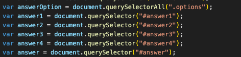
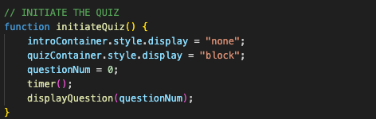

# JANET'S CODE QUIZ
### [View Project Here](https://twixmixyjanet.github.io/code-quiz/ "Code Quiz") 

| Technology Used    | Resource URL |
| --------  | ------- |
| HTML      | https://developer.mozilla.org/en-US/docs/Web/HTML |
| CSS       | https://developer.mozilla.org/en-US/docs/Web/CSS |
| JavaScript | https://developer.mozilla.org/en-US/docs/Web/JavaScript |
| Git       | https://git-scm.com/ |
| GitHub     | https://github.com/ |
| VSCode    | https://code.visualstudio.com/ |

## Table of Contents

* [Description](#description)
* [Installation](#installation)
* [Usage](#usage)
* [Credits](#credits)
* [License](#license)

## Description:
This is a JavaScript focused project with the goal to create a quiz app. 
Active Coding Time Spent:  
 
How to use this app:

* Click button "Start Quiz"
* Answer each question
* Enter Initials next to score
* Review high scores
* Return to game and try again!

#### User Story
- AS A coding boot camp student
- I WANT to take a timed quiz on JavaScript fundamentals that stores high scores
- SO THAT I can gauge my progress compared to my peers

#### Acceptance Criteria
- GIVEN I am taking a code quiz
- WHEN I click the start button
- THEN a timer starts and I am presented with a question
- WHEN I answer a question
- THEN I am presented with another question
- WHEN I answer a question incorrectly
- THEN time is subtracted from the clock
- WHEN all questions are answered or the timer reaches 0
- THEN the game is over
- WHEN the game is over
- THEN I can save my initials and score

### Lessons Learned

#### Selecting the proper DOM elements
The difference between selecting using querySelector and querySelectorAll to ensure the JS affects the DOM. In this example .options needed to be "All" so that it could select all elements with the class of ".options". 

#### Style display from "none" to "block" to "none"
With all of the elements existing on the same page, a lot of the section elements relied on having a style property for them to display or not. For basically every function in the JS, it's needed to update if these elements do or do not display.  

#### The Timer!!
A huge element of this project relied on the timer. 

#### Synopsis
Overall this project required a LOT of research and even more debugging to get things right. As much as possible I attempted to use console.log to check my work to affirm what my code was doing. I also utilized the help of a tutor to review my work and help me fix bugs I couldn't find on my own.

## Installation

1. Create a new repository on GitHub, to store this project.
2. Clone the repository to your computer.
3. Copy files to your own repository.
4. Make changes to the code.
5. Commit the changes to the local repo.
6. Push the changes to the remote repo.

## Usage

This is a password generator designed to produce a randomly generated password through various criteria. If you would like to use this app follow the installation steps and curate it to your needs. If you would like to use this app to generate a password, follow the steps under the description above and click the link at the top of this page.

## License

MIT License
Copyright (c) 2023 Twixmixy / Janet Webster

## About The Author
### Janet Webster
Full Stack MERN Software Engineer in training.

- [GitHub](https://github.com/TwixmixyJanet/)
- [LinkedIn](https://www.linkedin.com/in/twixmixy/)
- [Twitter](https://twitter.com/Twixmixy)
- [WakaTime](https://wakatime.com/@Twixmixy)

