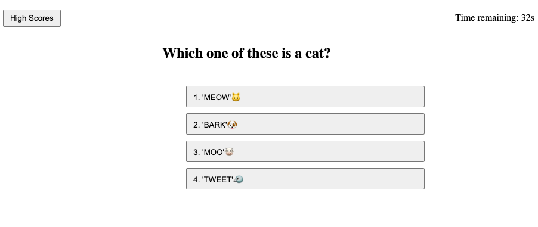
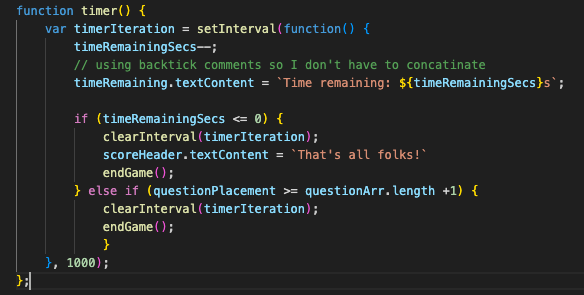
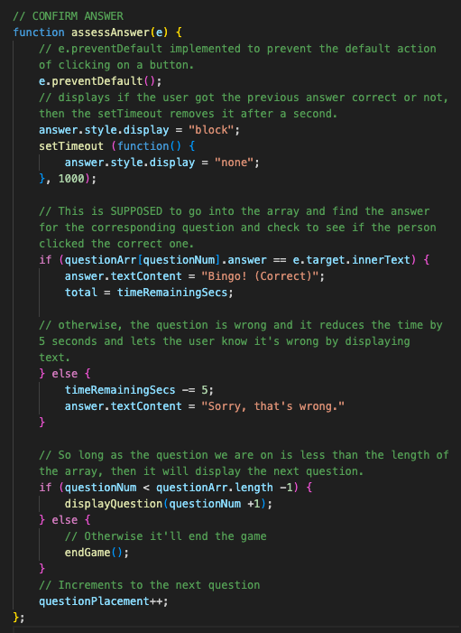

# JANET'S CODE QUIZ
### [View Project Here](https://twixmixyjanet.github.io/code-quiz/ "Code Quiz") 

| Technology Used    | Resource URL |
| --------  | ------- |
| HTML      | https://developer.mozilla.org/en-US/docs/Web/HTML |
| CSS       | https://developer.mozilla.org/en-US/docs/Web/CSS |
| JavaScript | https://developer.mozilla.org/en-US/docs/Web/JavaScript |
| Git       | https://git-scm.com/ |
| GitHub     | https://github.com/ |
| VSCode    | https://code.visualstudio.com/ |

## Table of Contents

* [Description](#description)
* [Installation](#installation)
* [Usage](#usage)
* [Credits](#credits)
* [License](#license)

## Description:
This is a JavaScript focused project with the goal to create a quiz app. 
Active Coding Time Spent:  
 
How to use this app:

* Click button "Start Quiz"
* Answer each question
* Enter Initials next to score
* Review high scores
* Return to game and try again!

#### User Story
- AS A coding boot camp student
- I WANT to take a timed quiz on JavaScript fundamentals that stores high scores
- SO THAT I can gauge my progress compared to my peers

#### Acceptance Criteria
- GIVEN I am taking a code quiz
- WHEN I click the start button
- THEN a timer starts and I am presented with a question
- WHEN I answer a question
- THEN I am presented with another question
- WHEN I answer a question incorrectly
- THEN time is subtracted from the clock
- WHEN all questions are answered or the timer reaches 0
- THEN the game is over
- WHEN the game is over
- THEN I can save my initials and score

### Lessons Learned

#### 1. Selecting the proper DOM elements
The difference between selecting using querySelector and querySelectorAll to ensure the JS affects the DOM. In this example .options needed to be "All" so that it could select all elements with the class of ".options". 

#### 2. Style display from "none" to "block" to "none"
With all of the elements existing on the same page, a lot of the section elements relied on having a style property for them to display or not. For basically every function in the JS, it's needed to update if these elements do or do not display.  

#### 3. The Timer!!
A huge element of this project relied on the timer. I practiced with the 99 bottles of beer on the wall by adding a timer to that. The additional component I had to work out was what to do if the seconds ran out or all of the questions were completed.  

#### 4. Assess The Answer
This function was the trickiest one to write. The main factor was the if state to see if they answer correct or not. I wanted to keep this simple as possible, so I took the question array => question number => answer and eqauted it to e.target.innerText. I found the solution of what to properly equate it to with the help of the tutor. Then I just had to make sure my question array answer string text was exactly the same as the option. Then another if statement was used to increment to the next question. Studying this with my tutor he mentioned I may have over-engineered the AssessAnswer function a bit, but it works, so for now it's good! 

#### Synopsis
Even more lessons were learned than above, but I wanted to highlight a a few of my favorites. Overall this project required a LOT of research and even more debugging to get things right. As much as possible I attempted to use console.log to check my work to affirm what my code was doing. I also utilized the help of a tutor to review my work and help me fix bugs I couldn't find on my own.   
P.S. I figured out how to preview the README in VSCode this past week, so now I don't have to push to GitHub to see how it looks.

## Installation

1. Create a new repository on GitHub, to store this project.
2. Clone the repository to your computer.
3. Copy files to your own repository.
4. Make changes to the code.
5. Commit the changes to the local repo.
6. Push the changes to the remote repo.

## Usage

This is a code quiz app which gives the user a timed quiz of preset questions and answers. If you would like to use this app follow the installation steps and curate it to your needs. If you would like to use this app to quiz your knowledge, follow the steps under the description above and click the link at the top of this page.

## License

MIT License
Copyright (c) 2023 Twixmixy / Janet Webster

## About The Author
### Janet Webster
Full Stack MERN Software Engineer in training.

- [GitHub](https://github.com/TwixmixyJanet/)
- [LinkedIn](https://www.linkedin.com/in/twixmixy/)
- [Twitter](https://twitter.com/Twixmixy)
- [WakaTime](https://wakatime.com/@Twixmixy)

